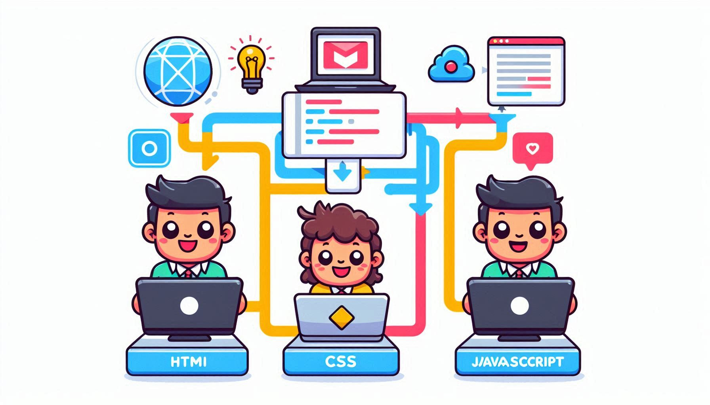

¡Hola, futuros creadores de la web! ¿Alguna vez has pensado en cómo se hacen las páginas web que visitas todos los días? ¿Te gustaría poder crear tus propios sitios web increíbles? ¡Pues estás en el lugar correcto! Hoy vamos a explorar el emocionante mundo del desarrollo web y descubrir por qué aprender HTML, CSS y JavaScript es como obtener superpoderes digitales.


## ¿Por qué aprender desarrollo web?

Imagina poder crear tu propio blog, diseñar un sitio web para tu banda favorita, o incluso hacer una aplicación que resuelva problemas en tu escuela. ¡Todo esto es posible cuando aprendes desarrollo web! Además, estas habilidades son muy valoradas en el mundo laboral. Muchas empresas buscan personas que sepan crear y mantener sitios web, así que aprender estas tecnologías puede abrirte muchas puertas en el futuro.

Las tres superhabilidades del desarrollo web:

## HTML: El poder de la estructura

HTML es como el esqueleto de una página web. Define qué elementos aparecerán en tu página y cómo se organizarán. Es como construir con bloques LEGO digitales.

Conceptos clave de HTML:

- Etiquetas: Son como instrucciones para el navegador. Por ejemplo, `<p>` significa "esto es un párrafo".
- Atributos: Dan información extra a las etiquetas. Como decirle a un bloque LEGO que sea de un color específico.
- Estructura semántica: Usar las etiquetas correctas para que tu página tenga sentido, como `<header>` para la cabecera o `<nav>` para el menú de navegación.

Uso en la industria: Todas las páginas web usan HTML. ¡Incluso los sitios más complejos como YouTube o Instagram tienen HTML en su base!

Ejemplo divertido:

```html:title=index.html
<body>
  <h1>Mi Zoológico Virtual</h1>
  <ul>
    <li>🐘 Elefante</li>
    <li>🦁 León</li>
    <li>🐧 Pingüino</li>
  </ul>
</body>
```

## CSS: El poder del estilo

Si HTML es el esqueleto, CSS es como la ropa y el maquillaje. Con CSS puedes hacer que tu página web se vea genial, colorida y única.

Conceptos clave de CSS:

- Selectores: Te permiten elegir qué elementos quieres estilizar.
- Propiedades: Son las características que puedes cambiar, como el color o el tamaño.
- Responsive design: Hacer que tu sitio se vea bien en computadoras, tablets y teléfonos.

Uso en la industria: Los diseñadores web usan CSS para crear interfaces atractivas y asegurarse de que los sitios se vean bien en todos los dispositivos.

Ejemplo divertido:

```css:title=style.css
.animal {
  font-size: 24px;
  color: #333;
  transition: transform 0.3s;
}

.animal:hover {
  transform: scale(1.2);
}
```

## JavaScript: El poder de la interactividad
JavaScript es como darle vida a tu página web. Permite que las cosas se muevan, cambien y reaccionen a lo que hace el usuario.

Conceptos clave de JavaScript:

- Variables: Como cajas donde guardas información.
- Funciones: Acciones que tu página puede realizar.
- Eventos: Reacciones a lo que hace el usuario, como hacer clic o mover el ratón.

Uso en la industria: Los desarrolladores usan JavaScript para crear aplicaciones web complejas, juegos en línea y experiencias interactivas.

Ejemplo divertido:

```javascript:title=app.js
function hacerRuidoAnimal(animal) {
  if (animal === '🐘') {
    alert('¡Bruuuu!');
  } else if (animal === '🦁') {
    alert('¡Roar!');
  } else if (animal === '🐧') {
    alert('¡Squawk!');
  }
}
```

### ¿Cómo empezar tu aventura en el desarrollo web?

1. Explora y experimenta: No tengas miedo de probar cosas nuevas. ¡Los mejores desarrolladores aprenden jugando!
2. Proyectos divertidos: Comienza con algo que te emocione. ¿Qué tal una página sobre tu videojuego favorito o una galería de fotos de tus mascotas?
3. Únete a la comunidad: Hay muchos otros chicos aprendiendo desarrollo web. Busca grupos en línea o clubes en tu escuela para compartir y aprender juntos.
4. Herramientas geniales: Usa sitios como Codepen o Repl.it para practicar. Son como parques de juegos digitales para programadores.
5. Nunca dejes de aprender: La web siempre está cambiando, así que siempre habrá cosas nuevas y emocionantes por descubrir.

> Recuerda, cada gran desarrollador web comenzó exactamente donde estás tú ahora. Con práctica, paciencia y mucha curiosidad, pronto estarás creando sitios web increíbles que asombrarán a todos tus amigos y familia.
¿Estás listo para comenzar tu aventura en el desarrollo web? ¡Adelante, futuro creador de la web! El mundo digital está esperando tus increíbles ideas.
