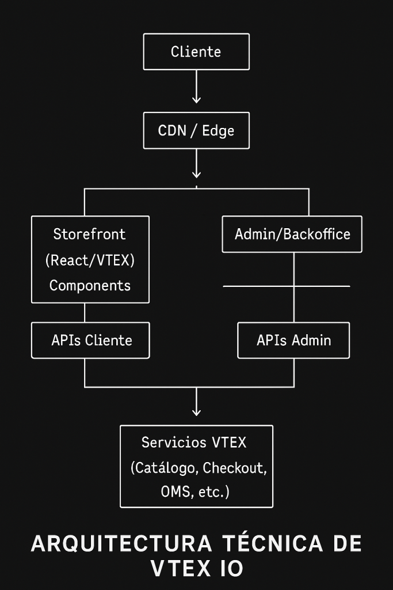

## ¿Qué es realmente VTEX IO?
VTEX IO no es simplemente otra plataforma de e-commerce. Es un ecosistema de desarrollo serverless diseñado para construir aplicaciones escalables en la nube con un enfoque en comercio electrónico. A diferencia de soluciones tradicionales, VTEX IO adopta una arquitectura moderna que separa el frontend del backend, permitiendo desarrollos más flexibles y mantenibles.

Para los desarrolladores experimentados, piensa en VTEX IO como una plataforma JAMstack con esteroides, específicamente orientada al e-commerce.

## Arquitectura técnica: Lo que necesitas saber

La arquitectura de VTEX IO está basada en tres pilares fundamentales:

1. **Infraestructura Serverless**: Olvídate de gestionar servidores. Todo tu código se ejecuta en un entorno containerizado y escalable automáticamente.
2. **Desarrollo basado en componentes**: La UI se construye mediante un sistema de composición de componentes React, permitiendo crear interfaces modulares y reutilizables.
3. **API-first**: Todas las funcionalidades están disponibles a través de APIs bien documentadas, facilitando la integración con sistemas externos.



## Stack tecnológico: Lo que vas a utilizar diariamente

Como desarrollador en VTEX IO, trabajarás con un conjunto moderno de tecnologías:

- **Frontend**: React, TypeScript, CSS, Styled Components
- **Backend**: Node.js, GraphQL, REST APIs
- **Herramientas**: VTEX CLI, Git, NPM/Yarn
- **Infraestructura**: AWS (bajo el capó)

Estructura de un proyecto VTEX IO

Un proyecto típico tiene esta estructura:

```text
mi-tienda-vtex/
├── manifest.json       # Configuración del proyecto
├── store/
│   ├── blocks/         # Configuración de bloques UI
│   └── interfaces.json # Definición de interfaces
├── react/              # Componentes React
│   ├── components/
│   └── index.tsx
└── node/               # Servicios backend (opcional)
  ├── clients/        # Clientes API
  ├── resolvers/      # Resolvers GraphQL
  └── index.ts
```

## Desarrollo Frontend: Componentes y Store Framework

El desarrollo frontend en VTEX IO gira en torno al concepto de **Store Framework**, una colección de componentes React reutilizables que implementan las funcionalidades comunes de e-commerce.

### Sistema de bloques declarativos
Una de las características más interesantes es el sistema de bloques declarativos. En lugar de escribir JSX directamente, defines la estructura de tu tienda mediante archivos JSON:

```JSON
{
  "store.home": {
    "blocks": [
      "carousel#home",
      "flex-layout.row#featured-products",
      "info-card#promotion"
    ]
  },
  
  "carousel#home": {
    "props": {
      "autoplay": true,
      "images": [
        {
          "src": "https://example.com/image1.jpg",
          "alt": "Promoción Verano"
        },
        {
          "src": "https://example.com/image2.jpg",
          "alt": "Nuevos Productos"
        }
      ]
    }
  }
}
```

Este enfoque declarativo tiene varias ventajas:

1. Consistencia visual a través de toda la tienda
2. Mayor velocidad de desarrollo al utilizar componentes pre-construidos
3. Separación entre estructura y diseño facilitando el trabajo en equipo
4. Actualizaciones más simples gracias a la modularidad

### Creando tus propios componentes React
Cuando necesites funcionalidades personalizadas, puedes crear tus propios componentes React:

```javascript
import React, { FC } from 'react'
import { useProduct } from 'vtex.product-context'
import { formatPrice } from 'vtex.format-currency'

interface PriceComparisonProps {
  showSavings?: boolean
  textColor?: string
}

const PriceComparison: FC<PriceComparisonProps> = ({ 
  showSavings = true,
  textColor = 'red'
}) => {
  const productContext = useProduct()
  const { product } = productContext
  
  if (!product) return null
  
  const listPrice = product.listPrice
  const sellingPrice = product.sellingPrice
  const savings = listPrice - sellingPrice
  const savingsPercentage = Math.round((savings / listPrice) * 100)
  
  return (
    <div className="price-comparison">
      <span className="list-price">
        {formatPrice(listPrice)}
      </span>
      <span className="selling-price" style={{ color: textColor }}>
        {formatPrice(sellingPrice)}
      </span>
      {showSavings && savings > 0 && (
        <span className="savings">
          ¡Ahorras un {savingsPercentage}%!
        </span>
      )}
    </div>
  )
}

export default PriceComparison
```

Para hacer este componente disponible en el sistema de bloques, necesitas exportarlo y registrarlo en tu **interfaces.json**.

```JSON
{
  "price-comparison": {
    "component": "PriceComparison"
  }
}
```

## Desarrollo Backend: Servicios y APIs
VTEX IO permite crear servicios backend para extender la funcionalidad de tu tienda. Estos servicios se implementan como aplicaciones Node.js que pueden:

1. Exponer APIs REST
2. Implementar resolvers GraphQL
3. Crear integraciones con sistemas externos
4. Procesar eventos en tiempo real

### Ejemplo de un servicio backend simple
Veamos un ejemplo de un servicio que implementa un resolver GraphQL para obtener productos recomendados:

```javascript
import { ServiceContext } from '@vtex/api'
import { Clients } from './clients'

export default {
  Query: {
    getRecommendedProducts: async (
      _: any,
      { userId, limit }: { userId: string; limit: number },
      ctx: ServiceContext<Clients>
    ) => {
      const { catalog, recommendation } = ctx.clients
      
      // Obtener preferencias del usuario desde un servicio personalizado
      const userPreferences = await recommendation.getUserPreferences(userId)
      
      // Buscar productos basados en las preferencias
      const products = await catalog.searchProductsByCategory(
        userPreferences.favoriteCategory,
        limit
      )
      
      return products.map(product => ({
        id: product.id,
        name: product.name,
        price: product.price,
        image: product.images[0]?.url
      }))
    }
  }
}
```

## Herramientas de desarrollo imprescindibles
El desarrollo en VTEX IO se potencia con varias herramientas esenciales:

### VTEX CLI
La interfaz de línea de comandos es tu mejor amiga para el desarrollo:

```shell
# Instalar la CLI
npm install -g vtex

# Iniciar sesión
vtex login mystore

# Crear un nuevo proyecto
vtex init

# Iniciar desarrollo local
vtex link

# Publicar una aplicación
vtex publish
```

### Workspaces: Entornos aislados
VTEX utiliza el concepto de workspaces para proporcionar entornos aislados:

```shell
# Crear un workspace de desarrollo
vtex use myfeature

# Listar workspaces
vtex workspace list

# Promover un workspace a producción
vtex workspace promote
```

## Ventajas para desarrolladores experimentados

Si vienes de otros entornos de desarrollo, hay varias razones por las que VTEX IO te resultará atractivo:

1. **Enfoque en código, no en infraestructura**: Sin servidores que administrar, te enfocas 100% en la lógica de negocio.

2. **Escalabilidad automática**: Tu aplicación escala automáticamente según la demanda.

3. **CI/CD integrado**: Los pipelines de integración y despliegue continuo están incluidos.

4. **Seguridad por diseño**: VTEX gestiona parches de seguridad, cumplimiento normativo y protección contra ataques.

5. **Ecosistema extensible**: Puedes aprovechar las apps de VTEX Marketplace o crear las tuyas propias.

## Limitaciones a considerar
Ninguna plataforma es perfecta. Estas son algunas limitaciones de VTEX IO que debes tener en cuenta:

1. **Curva de aprendizaje inicial**: El sistema de bloques declarativos requiere un cambio de mentalidad.

2. **Documentación dispersa**: Aunque ha mejorado, la documentación todavía puede ser fragmentada.

3. **Desafíos de depuración**: El entorno serverless puede dificultar la depuración en algunos casos.

4. **Ecosistema cerrado**: Algunas soluciones requieren mantenerse dentro del ecosistema VTEX.

## Primeros pasos: ¿Por dónde empezar?
Si estás listo para sumergirte en VTEX IO, estos son tus primeros pasos:

1. **Configurar tu entorno**: Instala Node.js, Yarn y la VTEX CLI.

2. **Crear una cuenta de desarrollo**: Regístrate en VTEX para obtener una cuenta de desarrollo.

3. **Explorar la documentación oficial**: Familiarízate con los conceptos básicos en la documentación de VTEX.

4. **Crear tu primera app**: Inicia un proyecto simple para entender el flujo de trabajo.

5. **Unirte a la comunidad**: Conéctate con otros desarrolladores en el GitHub de VTEX y en foros de la comunidad.

## Templates de código
VTEX ofrece una serie de templates base o boilerplates los cuales podemos usar para iniciar nuestro desarrollo, es nuestro punto de partida, te dejo acá los más populares:

Custom component:
https://github.com/vtex-apps/react-app-template

Rest Api:
https://github.com/vtex-apps/service-example

Graphql:
https://github.com/vtex-apps/graphql-example

## Conclusión
VTEX IO representa un enfoque moderno y potente para el desarrollo e-commerce, combinando la flexibilidad que los desarrolladores necesitan con la robustez que las empresas exigen. Su arquitectura basada en componentes, enfoque serverless y sistema de desarrollo extensible la convierten en una plataforma ideal para construir experiencias de comercio electrónico de próxima generación.

¿Estás listo para llevar tu desarrollo e-commerce al siguiente nivel con VTEX IO? El ecosistema está en constante evolución, y los desarrolladores con experiencia en esta plataforma son cada vez más demandados en el mercado.

> En próximos artículos, profundizaremos en aspectos específicos como el rendimiento, la creación de componentes avanzados y las mejores prácticas para integraciones. ¡No te los pierdas!

